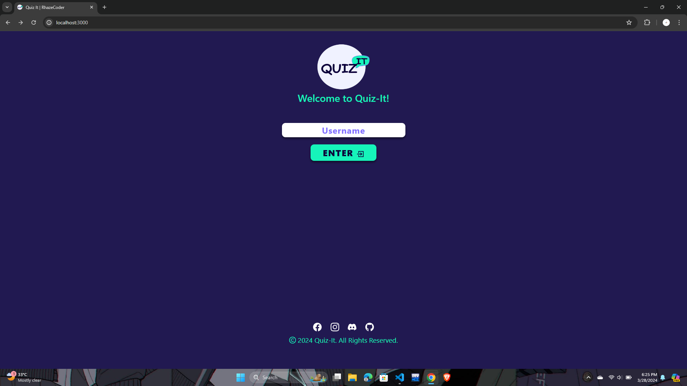
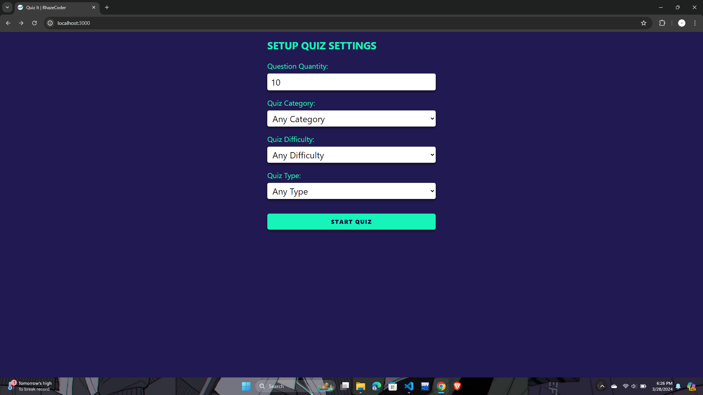
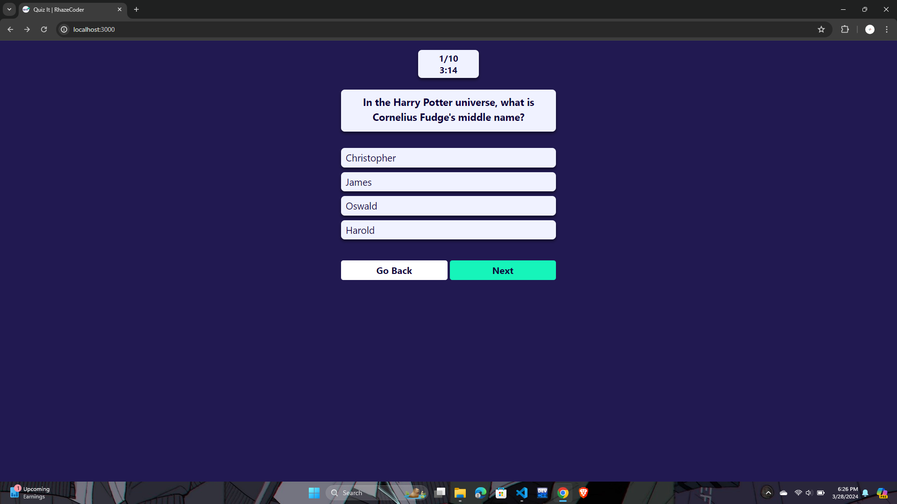
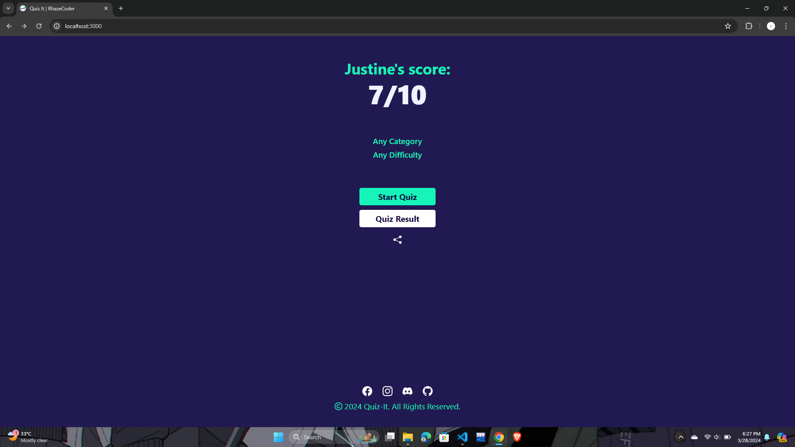
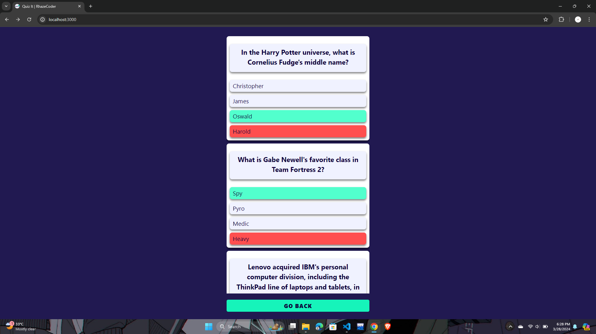

<h1>Quiz It</h1>

[Project Preview](https://quiz-it.justineagcanas.live/ "Project Preview")







### Introduction
------------
 - This is a quiz site. Api by <a href="https://opentdb.com/api_config.php"  target="_blank">Opentdb</a>

### Requirements
------------
To deploy locally you need to install the following
1. [git](https://git-scm.com/book/en/v2/Getting-Started-Installing-Git "git")
2. [node](https://nodejs.org/en "node")

### Installation
------------
```bash
git clone https://github.com/RhazeCoder/quiz-it
```
```bash
cd quiz-it
```
```bash
npm install
```

### Starting
------------
- To run the project
```bash
npm run start
```

### Disclaimer
------------
- This project is intended for **educational purposes only**.

***Coded with 🖤 Justine Agcanas***